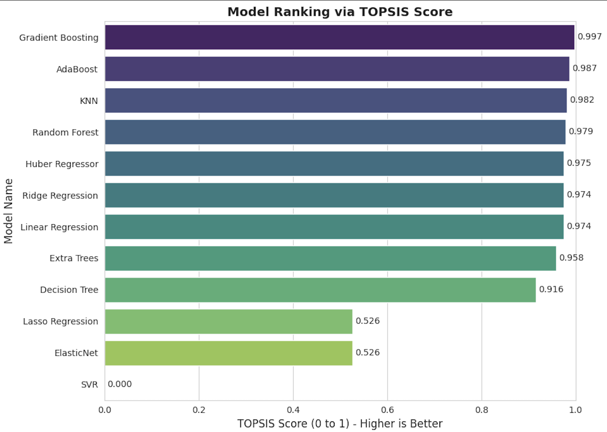

# Simulation-Driven Synthetic Data Generation & Model Selection

## Overview

This project presents an **end-to-end pipeline** that integrates **Modelling & Simulation** with **Machine Learning** for predictive analysis and objective model selection.

A **single-server queuing system (M/M/1)** is simulated using *Discrete Event Simulation (DES)* to generate a realistic synthetic dataset. Multiple regression models are trained on this dataset, and instead of selecting a model using a single metric, a **Multi-Criteria Decision Making (MCDM)** approach using **TOPSIS** is applied.

The project emphasizes:
- realism through simulation-based data generation  
- robustness through multi-metric evaluation  
- principled and explainable model selection  

---

## System Modelling & Data Generation

### Queue Model
- **Type:** M/M/1 (Single Server, Infinite Queue)
- **Simulation Engine:** SimPy

### Simulation Parameters
- **Arrival Rate (λ):** Randomized within a controlled range  
- **Service Rate (μ):** Randomized to maintain system stability  
- **Simulation Duration:** Fixed time horizon per run  

### Dataset Construction
- **Samples:** 1000 independent simulation runs  
- **Features:**
  - `Arrival_Rate`
  - `Service_Rate`
- **Target Variable:**
  - `Avg_Wait_Time`

The generated dataset captures **stochastic and non-linear behavior**, closely resembling real-world queueing systems.

---

## Machine Learning Workflow

### Preprocessing
- Train/Test Split: 80% / 20%
- Feature Scaling: `StandardScaler`

### Models Evaluated

**Linear Models**
- Linear Regression  
- Ridge Regression  
- Lasso Regression  
- ElasticNet  
- Huber Regressor  

**Instance / Kernel-Based Models**
- K-Nearest Neighbors (KNN)  
- Support Vector Regression (SVR)  

**Tree & Ensemble Models**
- Decision Tree  
- Random Forest  
- Extra Trees  
- Gradient Boosting  
- AdaBoost  

All models are trained under identical conditions for fair comparison.

---

## Evaluation Metrics

Each model is evaluated using multiple complementary metrics:

- Mean Absolute Error (MAE)
- Mean Squared Error (MSE)
- Root Mean Squared Error (RMSE)
- R² Score
- Explained Variance
- Maximum Error

This ensures evaluation across **accuracy, stability, and worst-case performance**.

---

## Model Ranking using TOPSIS

To objectively rank the models, **TOPSIS** is applied.

### Characteristics
- Treats model selection as a **decision-making problem**
- Considers both **benefit** and **cost** criteria
- Produces a normalized **TOPSIS score** ∈ [0, 1]

### Weighting Philosophy
- Higher importance assigned to predictive accuracy and stability
- Penalizes high variance and extreme prediction errors

---

## Results Summary

### TOPSIS-Based Model Ranking (Top 5)

| Rank | Model | R² Score | RMSE | Max Error | TOPSIS Score |
|----:|------------------|---------|-------|-----------|---------------|
| 1 | Gradient Boosting | 0.84 | 0.011 | 0.039 | 0.99 |
| 2 | AdaBoost | 0.82 | 0.012 | 0.038 | 0.98 |
| 3 | KNN | 0.81 | 0.012 | 0.040 | 0.98 |
| 4 | Random Forest | 0.81 | 0.013 | 0.040 | 0.97 |
| 5 | Huber Regressor | 0.81 | 0.013 | 0.043 | 0.97 |

**Observation:**  
Tree-based ensemble methods outperform linear models, confirming the **non-linear relationship** between queue parameters and waiting time.

---

## Visualizations

### TOPSIS Model Ranking

This bar chart visualizes the final TOPSIS scores for all evaluated models, clearly highlighting the superior performance of ensemble methods.



---

### Actual vs Predicted Waiting Time (Best Model)

This scatter plot compares the **actual waiting time** obtained from simulation against the **predicted waiting time** from the top-ranked model.

- The red dashed line represents perfect prediction (`y = x`)
- Tight clustering indicates strong predictive performance


---

### Error Distribution of Top Models

This histogram compares the prediction error distributions of the top-ranked models, offering insight into model stability and robustness beyond average metrics.


---

## ▶How to Run

1. Open the Jupyter Notebook in **Google Colab** or **Jupyter Lab**
2. Install required dependency:
   ```python
   !pip install simpy
   ```
3. Run all cells sequentially to:
   - generate synthetic data
   - train regression models
   - compute TOPSIS rankings
   - generate tables and visualizations

---

## Notes

- Entire dataset is **synthetically generated**
- No external datasets are used
- Results are reproducible due to controlled simulation design
